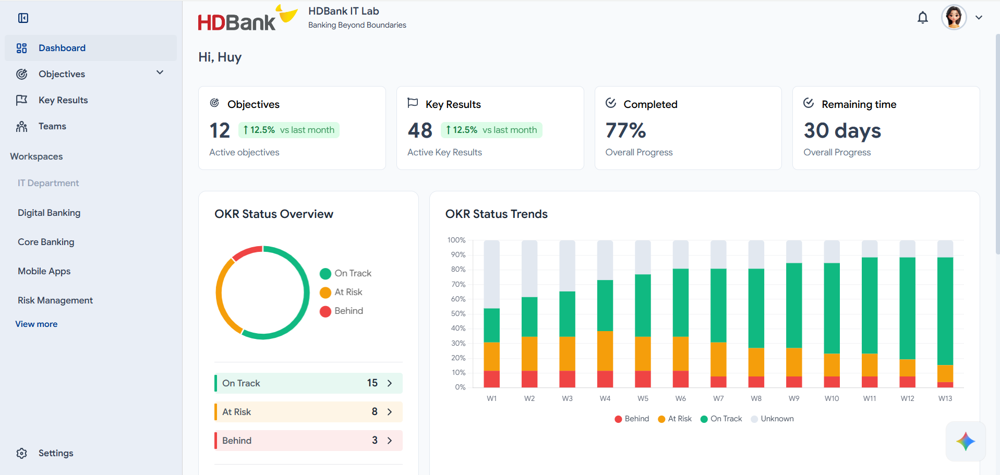

# OKR Management System (Frontend)



This is the frontend application for the OKR (Objectives and Key Results) Management System. It is a modern web application built with React, Vite, and TypeScript, designed to help organizations, teams, and individuals track their goals and progress effectively.

## 🚀 Features

-   **Dashboard**: A comprehensive overview of OKR status, trends, and progress.
-   **Objectives Management**:
    -   **Workspace Objectives**: High-level organizational goals.
    -   **Team Objectives**: Goals specific to different teams.
    -   **Personal Objectives**: Individual goals for employees.
    -   **Supporting Objectives**: Objectives that contribute to other goals.
-   **Key Results Tracking**: Detailed tracking of key results with progress indicators.
-   **Role-Based Access Control (RBAC)**:
    -   **Admin Panel**: Dedicated area for administrators.
    -   **Teams Management**: Accessible by managers and admins.
-   **User Settings**: Profile management and application settings.
-   **Interactive UI**:
    -   Data visualization using Charts (Chart.js, ECharts).
    -   Smooth animations with Lottie.
    -   Responsive design with Radix UI Themes and SCSS.
-   **Chatbot Integration**: Built-in support for AI assistance.

## 🛠️ Tech Stack

-   **Core**: [React 19](https://react.dev/), [TypeScript](https://www.typescriptlang.org/), [Vite](https://vitejs.dev/)
-   **State Management**: [Redux Toolkit](https://redux-toolkit.js.org/)
-   **Routing**: [React Router DOM](https://reactrouter.com/)
-   **Styling**: [SCSS](https://sass-lang.com/), [Radix UI Themes](https://www.radix-ui.com/)
-   **Forms**: [React Hook Form](https://react-hook-form.com/)
-   **Visualization**: [Chart.js](https://www.chartjs.org/), [ECharts](https://echarts.apache.org/)
-   **Icons**: [React Icons](https://react-icons.github.io/react-icons/)

## 📂 Project Structure

```
src/
├── assets/             # Static assets (fonts, images, lotties)
├── components/         # Reusable UI components
│   ├── Layout/         # Main application layout (Header, Sidebar)
│   ├── ProtectedRoute  # Route guard for authentication
│   ├── RoleBasedRoute  # Route guard for role-based access
│   └── ...
├── contexts/           # React Context providers (Chatbot, Loading)
├── pages/              # Application pages
│   ├── Dashboard/      # Main dashboard view
│   ├── Objectives/     # Objectives management pages
│   ├── KeyResults/     # Key results page
│   ├── Settings/       # User settings
│   ├── Login.tsx       # Authentication page
│   └── ...
├── services/           # API services
├── store/              # Redux store configuration
├── styles/             # Global styles and SCSS variables
├── App.tsx             # Main application component & Routing
└── main.tsx            # Entry point
```

## ⚡ Getting Started

### Prerequisites

-   Node.js (Latest LTS version recommended)
-   npm or yarn

### Installation

1.  Clone the repository:
    ```bash
    git clone <repository-url>
    ```
2.  Navigate to the project directory:
    ```bash
    cd okr-fe
    ```
3.  Install dependencies:
    ```bash
    npm install
    ```

### Running the Application

To start the development server:

```bash
npm run dev
```

The application will be available at `http://localhost:5173` (or the port shown in your terminal).

### Building for Production

To build the application for production:

```bash
npm run build
```

### Linting

To run the linter:

```bash
npm run lint
```

## 📜 Scripts

-   `dev`: Starts the Vite development server.
-   `build`: Compiles TypeScript and builds the app for production.
-   `lint`: Runs ESLint to check for code quality issues.
-   `preview`: Previews the production build locally.
